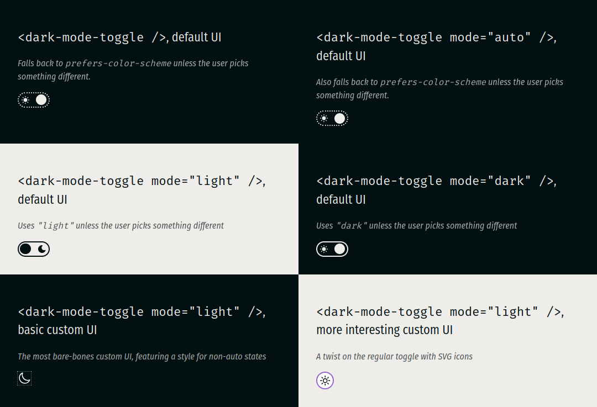

# `<dark-mode-toggle>`

A flexible web component for switching between light and dark modes. It keeps an internal state (called "mode") which reflects the user's preferences wrt. light/dark mode, using system preferences as a fallback. The element features TypeScript support, rich HTML, JS, content and CSS APIs to enable customization, a `darkmodechange` event, and can be controlled with touch, pointer devices and the keyboard.



## Installation

Install `@sirpepe/dark-mode-toggle`, then import the main module somewhere in the page. This will auto-register the element with the HTML tag `<dark-mode-toggle>`. If you need the tag name to be something else or want to change the custom element options, you can instead import the class `DarkModeToggleElement` from `@sirpepe/dark-mode-toggle/lib` and handle registration yourself.

## Demo

Open `demo.html` from `localhost` to see several instances of this element in action.

## Basic concepts

### Mode state

The element's _mode_ state is either `"dark"` or `"light"` and is computed as follows:

1. If the user or the JavaScript API select a mode, this selection determines the element's mode
2. If that's not done, the element's content attribute `mode` determines the element's mode
3. If the `mode` attribute is not set (or set to `"auto"` or an invalid value), the mode is auto-detected via the [prefers-color-scheme](https://developer.mozilla.org/en-US/docs/Web/CSS/@media/prefers-color-scheme) media feature and therefore dependent on system or browser preferences

The element is always either in dark mode or light mode, either of which may or may not have been chosen deliberately.

### Auto state

The element's _auto_ state is either `true` or `false` and reflects whether the current mode state has been chosen by the user or by the system/browser defaults. It is `true` if the user or the JS API have interacted with the element or if the `mode` content attribute is set to either `"dark"` or `"light"`.

## Content attributes

### `mode`

Selects the default mode state. Its value, if valid, determines the mode state, unless either the user or the JS API select a different mode. Valid values are `"light"`, `"dark"` or `"auto"`. If the attribute is missing or set to an invalid value, the mode remains unchanged.

```html
<!-- Auto-detects the mode from the system/browser preferences -->
<dark-mode-toggle></dark-mode-toggle>

<!-- Also auto-detects the mode from the system/browser preferences -->
<dark-mode-toggle mode="auto"></dark-mode-toggle>

<!-- Defaults to "light", ignoring the system/browser preferences -->
<dark-mode-toggle mode="light"></dark-mode-toggle>

<!-- Defaults to "dark", ignoring the system/browser preferences -->
<dark-mode-toggle mode="dark"></dark-mode-toggle>

<!-- Invalid value, falls back to system/browser preferences -->
<dark-mode-toggle mode="asdf"></dark-mode-toggle>

<!-- Defaults to "dark", ignoring the system/browser preferences, but is set to "light" via a script -->
<dark-mode-toggle mode="dark" class="scripted"></dark-mode-toggle>
<script>
  document.querySelector(".scripted").mode = "light";
</script>
```

Changes to the content attribute via [`setAttribute()`](https://developer.mozilla.org/en-US/docs/Web/API/Element/setAttribute) and similar APIs only affect the `mode` state if the element has not yet been interacted with - just like `value` on `<input>`. The content attribute serve as a mere fallback or default value and is always overruled by user or script input.

## Custom user interface

The default user interface is a simple toggle. You can replace it with a custom UI by adding markup between the opening and closing `<dark-mode-toggle>` tags. The following replaces the default UI with two SVG icons:

```html
<dark-mode-toggle class="basic">
  <svg
    class="light"
    xmlns="http://www.w3.org/2000/svg"
    fill="none"
    viewBox="0 0 24 24"
    stroke-width="1.5"
    stroke="currentColor"
  >
    <path stroke-linecap="round" stroke-linejoin="round" d="..." />
  </svg>
  <svg
    class="dark"
    xmlns="http://www.w3.org/2000/svg"
    fill="none"
    viewBox="0 0 24 24"
    stroke-width="1.5"
    stroke="currentColor"
  >
    <path stroke-linecap="round" stroke-linejoin="round" d="..." />
  </svg>
</dark-mode-toggle>
```

You can use CSS states to style your custom UI to match the element's mode.

## CSS States

The following custom states are supported by the element:

- `light` is set when the mode state is `"light"`
- `dark` is set when the mode state is `"dark"`
- `auto` is set when the mode state is governed by system/browser preferences

These states can be used with the [`:state()` pseudo class](https://developer.mozilla.org/en-US/docs/Web/CSS/:state) to style custom UIs. Assuming the HTML from the example above:

```css
/* Scale the element for the SVGs */
dark-mode-toggle.basic {
  width: 24px;
  height: 24px;
}
/* Styles for light mode */
dark-mode-toggle.basic:state(light) {
  color: #000; /* sets the SVG line color */
  > svg.dark {
    display: none;
  }
}
/* Styles for dark mode */
dark-mode-toggle.basic:state(dark) {
  color: #fff; /* sets the SVG line color */
  > svg.light {
    display: none;
  }
}
/* Styles for non-auto */
dark-mode-toggle.basic:not(:state(auto)) {
  outline: 1px dotted skyblue;
}
/* Styles to maintain basic usability */
dark-mode-toggle:focus-within {
  box-shadow: 0 0 1em skyblue;
}
```

The [`:has()`](https://developer.mozilla.org/en-US/docs/Web/CSS/:has) selector can be combined with the `:state()` pseudo class to tie a web page's CSS to the element state. The following example combines the above with [the `color-scheme` property](https://developer.mozilla.org/en-US/docs/Web/CSS/color-scheme) and [the `light-dark()` color function](https://developer.mozilla.org/en-US/docs/Web/CSS/color_value/light-dark) to implement a minimal side-wide dark mode.

```css
:root {
  color-scheme: light dark;
  color: light-dark(#031011, #efedea);
  background-color: light-dark(#efedea, #031011);
}
:root:has(dark-mode-toggle:state(light)) {
  color-scheme: only light;
}
:root:has(dark-mode-toggle:state(dark)) {
  color-scheme: only dark;
}
```

Because the element's mode state reflects the user's preferences with the system/browser defaults as fallback, the above CSS is entirely sufficient to implement dark/light mode - no more `@media` rules required.

## CSS Variables

The default UI's accent color can be changed by setting `--dark-mode-toggle-accent-color`. It defaults to `rebeccapurple`.

## JavaScript API

### Getter `mode`

Returns the element's mode state (either `"dark"` or `"light"`).

### Setter `mode`

Sets the element's mode state. Valid values are `"dark"`, `"light"`, and `"auto"`. Invalid values will be rejected with exceptions. The new value, if valid, determines the element's mode state.

### Readonly property `auto`

Returns the element's auto state.

### Event `darkmodechange`

✅ bubbles ✅ composed ❌ cancelable

The `darkmodechange` event is dispatched every time the element's mode changes. Its `mode` and `auto` properties reflect the element's new mode and auto states.

## Limitations

The element currently relies on a global `window` and can therefore not easily be SSR'd.
